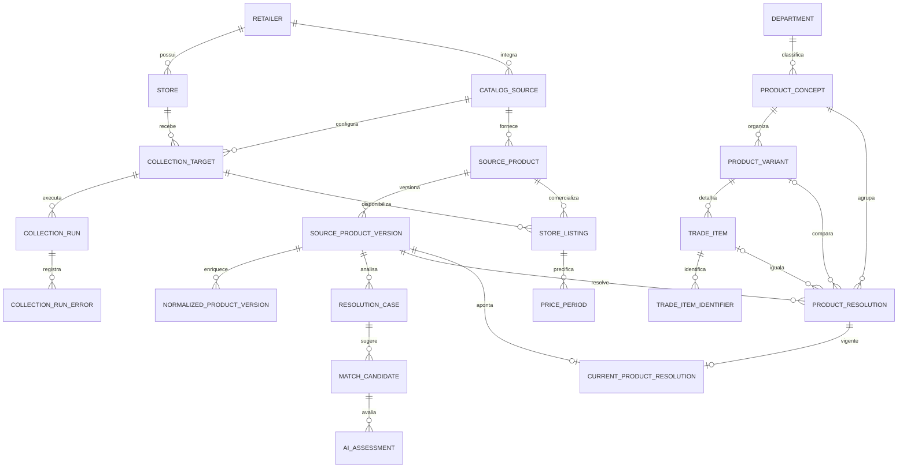

# Arquitetura proposta para coleta e enriquecimento do catálogo

Última atualização: 2026-09-02.

Status: **proposta de arquitetura; ainda não implementada**.

Este documento descreve a evolução completa do fluxo de catálogos obtidos por
APIs: múltiplas redes e filiais, identidade original das fontes, histórico de
preço somente por mudança, normalização, enriquecimento, resolução entre
produtos, uso controlado de IA e consultas de comparação.

O modelo atual está documentado em [`DATABASE-ERD.md`](DATABASE-ERD.md). Este
documento é o desenho de destino e deve orientar as próximas migrações; ele não
substitui a descrição do estado atual.

## 1. Objetivos

O modelo proposto deve permitir:

- coletar catálogos de muitas APIs e muitas filiais da mesma rede;
- preservar os códigos, descrições e demais atributos recebidos de cada fonte;
- armazenar preço e disponibilidade por filial real;
- evitar uma nova linha histórica quando o estado de preço não mudou;
- registrar todas as transições, inclusive `A → B → A` no mesmo dia;
- pesquisar exatamente o mesmo item comercial entre redes;
- pesquisar variações comparáveis do mesmo produto;
- pesquisar conceitos amplos, como `Peito de frango`, `Costela bovina` e
  `Contrafilé`, mesmo quando marca não for relevante;
- executar normalização e IA apenas para produtos novos ou materialmente
  alterados, e não a cada preço coletado;
- impedir que uma decisão canônica aprovada seja alterada automaticamente;
- corrigir decisões equivocadas de forma explícita, versionada e auditável;
- manter o PostgreSQL como banco principal e reduzir CPU, memória, disco, WAL e
  custo de inferência.

## 2. Fora do escopo desta fase

O fluxo de encartes, imagens, anotação visual, OCR e extração por modelo de
visão não será integrado ao novo catálogo nesta fase.

As tabelas e arquivos existentes de encartes não devem ser apagados. A decisão
recomendada é:

1. interromper novas escritas desse domínio;
2. mantê-lo acessível para auditoria;
3. isolá-lo em um schema ou profile de containers separado;
4. retomar sua integração somente depois de o catálogo por API estar estável.

Também não se recomenda, neste momento:

- adotar outro banco apenas para séries temporais;
- dividir o sistema em vários microsserviços implantados separadamente;
- particionar tabelas que ainda não chegaram a dezenas de milhões de eventos;
- executar IA contra todos os pares possíveis de produtos;
- alterar códigos internos recebidos das fontes.

## 3. Diagnóstico do modelo atual

O modelo atual não é excessivamente complexo por quantidade de tabelas. A
complexidade vem da mistura de responsabilidades e do modo como o histórico é
gravado.

Os principais pontos são:

- `catalog_products` identifica um produto por `(retailer_id, external_id)`, mas
  não representa explicitamente o namespace da API;
- não existe uma entidade permanente produto-da-fonte × filial;
- `store_id` é repetido em `catalog_runs` e
  `catalog_price_observations`, podendo ficar inconsistente;
- `store_id` pode ser nulo mesmo em observações que deveriam representar preço
  de uma filial;
- cada coleta grava novamente todos os produtos, mesmo sem alteração de preço;
- o painel precisa consultar a última coleta para reconstruir o estado atual;
- campos derivados como preço anterior, diferença, percentual e desconto são
  repetidos no histórico;
- o processo carrega grandes coleções no ORM, em vez de fazer ingestão e
  comparação em lote;
- os domínios de catálogo e encarte aparecem juntos no mesmo ERD, embora operem
  de forma independente;
- ainda não há conceito, variante, item comercial exato ou vínculo canônico
  entre redes.

### 3.1 Medição da base local

Medição executada em 2026-09-02 sobre a base local migrada:

| Medida | Resultado |
| --- | ---: |
| Observações em `catalog_price_observations` | 3.553.195 |
| Primeiros estados ou mudanças consecutivas reais | 343.096 |
| Redução potencial de linhas do histórico | 90,34% |
| Dados da tabela atual | 557 MB |
| Índices da tabela atual | 612 MB |
| Total da tabela e índices | 1.169 MB |

A assinatura usada nessa medição considerou preço regular, preço de venda,
tags, desconto e faixas por quantidade; estoque foi deliberadamente excluído.
O tamanho final não será exatamente 9,66% do atual porque haverá listings,
runs, índices e metadados. Ainda assim, a mudança reduz o principal fator de
crescimento: a frequência de coleta deixa de criar histórico quando nada mudou.

## 4. Princípios obrigatórios

### 4.1 Separar origem, interpretação e decisão

O dado recebido da fonte não é o dado canônico:

```text
Fonte/API → dado original → dado normalizado → candidatos → decisão aprovada
```

Cada camada escreve em estruturas diferentes. Nenhum normalizador ou modelo de
IA sobrescreve o dado original.

### 4.2 Preço pertence ao listing da filial

A unidade correta para preço é:

```text
produto da fonte + filial + configuração da integração
```

O preço não deve apontar diretamente para um produto canônico. Dessa maneira,
uma correção de classificação não modifica nem destrói o histórico original.

### 4.3 Identidade aprovada é imutável, mas corrigível

Uma resolução aprovada não recebe `UPDATE` ou `DELETE`. Uma correção insere uma
nova resolução que substitui explicitamente a anterior, mantendo autoria,
motivo e vigência.

Assim, "não mudar" significa não mudar automaticamente ou silenciosamente. Não
significa perpetuar para sempre um erro ou um código externo reutilizado.

### 4.4 Histórico representa transições, não coletas

As execuções continuam auditáveis em `collection_runs`. O histórico de preço,
porém, cresce somente quando o estado comercial muda.

### 4.5 Coleta parcial não prova ausência

Se uma página, categoria ou endpoint falhar, os produtos que não apareceram não
podem ser desativados. Ausência só pode ser interpretada depois de uma coleta
integral considerada completa.

### 4.6 Estado atual não depende da última run

O painel consulta o período de preço aberto de cada listing. Ele não consulta
apenas observações criadas pela última execução. Isso evita que produtos sem
mudança desapareçam da busca.

## 5. Terminologia

| Termo | Definição |
| --- | --- |
| Retailer | Rede ou bandeira comercial, como Assaí, Tenda ou Max. |
| Store | Filial física ou operação virtual explicitamente cadastrada. |
| Catalog source | Namespace de uma API na qual os IDs externos são únicos. |
| Collection target | Configuração de uma source para uma store específica. |
| Source product | Identidade estável recebida da fonte. |
| Source product version | Fotografia imutável dos atributos descritivos quando eles mudam. |
| Store listing | Produto da fonte comercializado em uma filial. |
| Price period | Intervalo contínuo em que o estado comercial permaneceu igual. |
| Product concept | Conceito amplo de compra, como `Peito de frango`. |
| Product variant | Especificação comparável, como filé sem osso resfriado por kg. |
| Trade item | Item comercial exato, normalmente definido por marca, embalagem e GTIN. |
| Resolution | Decisão que liga uma versão da fonte aos níveis canônicos. |
| Current resolution | Ponte mutável que seleciona qual decisão imutável está vigente para uma versão da fonte. |

## 6. Visão lógica do modelo-alvo



O modelo contém mais entidades conceituais que o schema atual, mas cada tabela
tem uma responsabilidade única. As tabelas volumosas são somente
`store_listings` e `price_periods`; as tabelas canônicas e de decisão crescem
por produto novo ou revisão, não por coleta.

## 7. Domínio de fontes, lojas e execução

### 7.1 `retailers`

Mantém a rede comercial.

Campos recomendados:

```text
id
name
slug
active
created_at
updated_at
```

Restrições:

- `UNIQUE(slug)`;
- `slug` não deve ser reutilizado depois de desativado.

### 7.2 `stores`

Representa a filial interna e não os vários códigos usados por APIs.

Campos recomendados:

```text
id
retailer_id
name
cnpj opcional
address
city
state
postal_code
latitude e longitude opcionais
timezone
kind: PHYSICAL, ONLINE ou REGIONAL
active
```

O CNPJ, quando disponível e validado, é um identificador melhor do que nome ou
cidade. A aplicação deve parar de localizar filiais por texto.

### 7.3 `catalog_sources`

Uma source representa o namespace técnico da API. Os segredos não ficam nessa
tabela.

```text
id
retailer_id
code
provider_type
base_url
public_config JSONB
active
created_at
```

Exemplos de `code`:

```text
max-public-api
tenda-public-api
savegnago-vtex
meu-assai-authenticated-api
```

Restrição:

```text
UNIQUE(retailer_id, code)
```

Credenciais, tokens e proxies permanecem em secrets do ambiente.

### 7.4 `collection_targets`

Um target liga a source a uma filial e concentra a configuração necessária
para consultar aquela unidade.

```text
id
source_id
store_id
external_store_id
external_store_code
seller_id
sales_channel
reference_postal_code
public_config JSONB
active
schedule_group
created_at
updated_at
```

Exemplo Max:

```text
source: max-public-api
store: Max Atacadista Campinas
external_store_id: 606
external_store_code: 141
reference_postal_code: 13184-222
```

Exemplo Savegnago:

```text
source: savegnago-vtex
store: Hortolândia LJ 55
seller_id: 1
reference_postal_code: 13184-222
pickup point: Retira Loja 55, em public_config
```

Restrições:

- impedir dois targets ativos equivalentes;
- validar que source e store pertencem à mesma rede;
- uma operação nacional deve usar uma store virtual explícita, nunca `NULL`.

### 7.5 `collection_runs`

Registra a execução, não os produtos individualmente.

```text
id
target_id
ingestion_key
status
started_at
observed_at
finished_at
is_complete
pages_expected
pages_succeeded
pages_failed
items_seen
items_priced
items_new
items_changed
items_unchanged
listings_activated
listings_deactivated
price_periods_created
error_count
collector_version
payload_uri
payload_sha256
created_at
```

`ingestion_key` é criado antes da execução e reutilizado em retries. Não se deve
usar somente `collected_at` como mecanismo de idempotência.

Restrição:

```text
UNIQUE(target_id, ingestion_key)
```

### 7.6 `collection_run_errors`

Uma linha por escopo que falhou:

```text
id
run_id
sequence
scope_type
scope_key
page_number
cursor
endpoint
http_status
attempt_count
error_class
message
occurred_at
```

Isso sustenta o painel de log linha a linha e permite agregar falhas por página,
departamento, filial, fonte ou código HTTP.

## 8. Produto original e listing por filial

### 8.1 `source_products`

É a identidade persistente do item dentro da source.

```text
id
source_id
external_id
internal_code
current_version_id
current_product_url
current_image_url
first_seen_at
last_seen_at
active
```

Restrições e índices:

```text
UNIQUE(source_id, external_id)
INDEX(source_id, active)
```

`external_id` e `internal_code` não podem ser substituídos por códigos
canônicos. Se uma API usa IDs locais por filial, ela precisa declarar um
namespace de source compatível ou um `external_listing_id` no listing.

### 8.2 `source_product_versions`

Armazena uma versão somente quando os atributos relevantes da fonte mudam.

```text
id
source_product_id
version
raw_name
raw_brand
raw_gtin
raw_categories JSONB
raw_measure
raw_quantity
raw_unit
raw_package
raw_product_url
raw_image_url
raw_attributes JSONB
raw_hash
identity_input_hash
valid_from
valid_until
first_run_id
created_at
```

Restrições:

```text
UNIQUE(source_product_id, version)
UNIQUE parcial(source_product_id) WHERE valid_until IS NULL
```

O hash de enriquecimento deve excluir preço, estoque, horário e atributos
puramente visuais. Imagem pode ser atualizada como apresentação sem provocar
nova resolução de identidade. O hash é comparado somente com a versão aberta;
ele não deve ser único em todo o histórico, pois `A → B → A` precisa preservar
três intervalos cronológicos.

### 8.3 `store_listings`

É a associação source product × target/filial.

```text
id
target_id
source_product_id
external_listing_id opcional
active
availability: AVAILABLE, OUT_OF_STOCK, UNAVAILABLE ou UNKNOWN
stock_current opcional
first_seen_at
last_seen_at
last_seen_run_id
price_status: KNOWN, UNKNOWN, UNAVAILABLE ou WITHHELD
created_at
updated_at
```

Restrição:

```text
UNIQUE(target_id, source_product_id)
```

O estoque exato fica apenas no estado atual. Um histórico de disponibilidade
pode ser criado futuramente, se houver caso de negócio, mas não deve inflar o
histórico de preços.

## 9. Histórico de preços por período

### 9.1 Estrutura

`price_periods` guarda um período contínuo de estado comercial.

```text
id BIGINT
store_listing_id BIGINT
version INTEGER
started_at TIMESTAMPTZ
last_confirmed_at TIMESTAMPTZ
ended_at TIMESTAMPTZ NULL
first_run_id
last_run_id
confirmation_count BIGINT
currency CHAR(3)
regular_price_cents INTEGER NULL
effective_price_cents INTEGER NULL
best_conditional_price_cents INTEGER NULL
normalized_unit_price_micros BIGINT NULL
price_basis_unit
price_terms JSONB
promotion_valid_from TIMESTAMPTZ NULL
promotion_valid_until TIMESTAMPTZ NULL
state_hash BYTEA
created_at
```

O período aberto, com `ended_at IS NULL`, é o preço atual conhecido.

Índices principais:

```sql
CREATE UNIQUE INDEX uq_price_period_open
    ON price_periods (store_listing_id)
    WHERE ended_at IS NULL;

CREATE UNIQUE INDEX uq_price_period_version
    ON price_periods (store_listing_id, version);

CREATE INDEX ix_price_period_history
    ON price_periods (store_listing_id, started_at DESC);
```

Não indexar `last_confirmed_at`, `last_run_id` ou `confirmation_count` permite
que confirmações iguais usem atualizações HOT com menor amplificação de WAL,
desde que a tabela tenha espaço livre adequado.

### 9.2 Estado usado no hash

O `state_hash` é calculado a partir de uma representação canônica contendo:

- moeda;
- preço regular;
- preço efetivo sem condição especial;
- menor preço condicional;
- preços de clube e aplicativo;
- preços por quantidade;
- quantidade mínima;
- forma de pagamento relevante;
- base de preço (`KG`, `L`, `UN`);
- validade promocional, quando informada;
- identidade comercial relevante quando quantidade/embalagem mudar.

Devem ser excluídos:

- `run_id`;
- horário da coleta;
- estoque exato;
- ordem original das tags;
- tags duplicadas;
- descrição promocional apenas visual;
- nome e imagem do produto;
- campos calculáveis a partir dos preços.

Antes de calcular o hash:

1. preços devem virar inteiros em centavos;
2. listas devem ser ordenadas;
3. tags devem ser normalizadas e deduplicadas;
4. objetos JSON devem ter chaves ordenadas;
5. valores ausentes precisam ter semântica consistente;
6. unidades e quantidades devem ser normalizadas.

### 9.3 Algoritmo de persistência

Para cada listing:

1. localizar e bloquear o período aberto;
2. comparar seu hash com o hash recebido;
3. se forem iguais, atualizar confirmação e não inserir histórico;
4. se forem diferentes, fechar o período anterior e inserir o novo;
5. se não houver período, inserir a versão inicial.

Exemplo:

```text
09:00  R$ 10,00 → cria período 1
11:00  R$ 10,00 → período 1, confirmation_count += 1
14:00  R$ 12,00 → fecha período 1 e cria período 2
18:00  R$ 10,00 → fecha período 2 e cria período 3
```

Não se deve impor `UNIQUE(produto, filial, data, preço)`: essa regra perderia a
volta ao preço anterior no mesmo dia.

### 9.4 Preço nulo

Preço `NULL` pode significar coisas diferentes:

- a fonte não publicou o preço;
- preço disponível apenas após login;
- item indisponível;
- falha de uma página;
- ausência transitória do campo;
- erro do parser.

O coletor deve entregar `price_status` explícito. `UNKNOWN`, `WITHHELD`, erro ou
coleta parcial não fecham o último preço conhecido. O painel pode ocultar o
preço como atual e apresentar o último valor conhecido com horário e estado de
frescor.

### 9.6 Eventos fora de ordem

Uma coleta atrasada não pode substituir o estado atual. Se `observed_at` for
anterior ao período aberto, a ingestão deve preservar o artefato, registrar o
conflito e encaminhar a informação para reconciliação histórica. Ela não altera
automaticamente o período corrente.

O timestamp não é a identidade do evento: duas transições podem compartilhar o
mesmo instante. `version` mantém a ordem do listing, e o merge é serializado por
target/listing.

### 9.5 Campos removidos do histórico

Estes campos atuais são derivados e não precisam ocupar cada evento:

- `previous_sales_price`;
- `price_change_amount`;
- `price_change_percent`;
- `discount`.

Eles são calculados comparando períodos consecutivos ou o preço regular com o
efetivo.

## 10. Arquitetura dos coletores

### 10.1 Responsabilidade do adaptador

Cada coletor deve ser um adaptador da API para um contrato comum. Ele pode:

- autenticar na fonte usando secrets do ambiente;
- resolver cookies, tokens e sessão;
- percorrer departamentos, páginas e cursores;
- respeitar rate limit e `Retry-After`;
- interpretar o payload específico;
- devolver códigos, atributos e preços com proveniência;
- classificar falhas pelo escopo exato.

Ele não deve:

- escrever diretamente no banco;
- decidir que dois produtos de redes diferentes são iguais;
- alterar conceitos ou produtos canônicos;
- calcular variação contra o banco;
- desativar produtos por conta própria;
- considerar ausência numa página parcial como indisponibilidade;
- armazenar secrets em `public_config` ou artefatos.

### 10.2 Contrato normalizado de saída

Exemplo conceitual:

```json
{
  "source_product": {
    "external_id": "12168",
    "internal_code": "12168",
    "gtin": "7891050001108",
    "name": "Aguardente São Francisco Garrafa 970ml",
    "brand": "SAO FRANCISCO",
    "source_categories": ["Bebidas", "Aguardentes e Uísques"],
    "measure": "UN",
    "quantity": 970,
    "unit": "ML",
    "product_url": null,
    "image_url": "https://...",
    "raw_attributes": {}
  },
  "listing": {
    "external_listing_id": null,
    "availability": "AVAILABLE",
    "stock": 183
  },
  "price": {
    "status": "KNOWN",
    "currency": "BRL",
    "regular_price_cents": 3299,
    "effective_price_cents": 3299,
    "terms": []
  },
  "provenance": {
    "department_id": "2",
    "page": 1,
    "position": 1
  }
}
```

Valores monetários nunca devem atravessar o contrato como `float`. O adaptador
pode receber decimal, número ou texto, mas precisa emitir centavos inteiros ou
uma representação decimal exata.

### 10.3 Interface recomendada

Em vez de retornar todo o catálogo em uma lista na memória, o coletor deve
produzir páginas ou itens progressivamente:

```python
class CatalogAdapter(Protocol):
    async def collect(
        self,
        target: CollectionTarget,
        context: CollectionContext,
    ) -> AsyncIterator[CatalogPage]: ...
```

Cada `CatalogPage` contém:

```text
scope
page/cursor
items
is_last
request metadata sem secrets
```

Isso permite gravar staging e artefato à medida que as páginas chegam, sem
manter centenas de milhares de produtos na memória do worker.

### 10.4 Configuração, não código por filial

O código do provider conhece o protocolo da fonte. Os IDs de filial, seller,
canal e CEP ficam em `collection_targets`.

Para adicionar uma nova filial de uma fonte já suportada, o fluxo deve ser:

1. cadastrar `store`;
2. cadastrar `collection_target`;
3. validar a filial com uma coleta pequena;
4. ativar o target;
5. deixar o scheduler descobri-lo no banco.

Não deve ser necessário criar classe, comando ou chave nova num dicionário
Python para cada filial.

### 10.5 Estratégias de APIs diferentes

Há dois padrões principais.

#### Catálogo global e preço por loja

Quando a API separa metadados e preço:

1. catálogo de produtos é obtido uma vez por source;
2. cada target consulta somente preço/estoque;
3. `source_products` não é duplicado por filial;
4. `store_listings` e `price_periods` crescem por filial.

#### Produto e preço combinados por loja

Quando a API só retorna tudo junto para uma loja:

1. a chamada de rede precisa acontecer por target;
2. a ingestão resolve o mesmo `source_product` pela chave da source;
3. atributos idênticos não criam novas versões;
4. apenas listing, disponibilidade e preço são específicos da filial.

### 10.6 Orquestração de uma coleta

Fluxo recomendado:

```text
Scheduler
  → cria ingestion_key
  → enfileira target
Worker
  → adquire lock do target
  → cria collection_run RUNNING
  → coleta páginas
  → grava NDJSON comprimido e staging
  → persiste erros individuais
  → aplica lote no catálogo
  → calcula diferenças de listing e preço
  → conclui SUCCESS, PARTIAL_SUCCESS ou FAILED
```

Etapas detalhadas:

1. adquirir advisory lock ou lock distribuído por `target_id`;
2. criar ou recuperar a run pelo `ingestion_key`;
3. iniciar artefato compactado, sem secrets;
4. consultar a fonte com timeout, retry exponencial e jitter;
5. validar cada item antes do staging;
6. inserir staging com chave `(run_id, external_id)`;
7. registrar falhas sem descartar páginas válidas;
8. executar `COPY` ou inserção em lote;
9. fazer upsert de produtos, versões e listings;
10. atualizar períodos iguais em lote;
11. fechar e inserir períodos alterados;
12. desativar listings ausentes somente se `is_complete=true`;
13. persistir contagens e hash do artefato;
14. concluir a transação;
15. publicar jobs de enriquecimento pela outbox.

### 10.7 Staging

Para escala, a persistência não deve fazer uma consulta ORM por produto. Use
uma tabela temporária ou `UNLOGGED` por run, contendo:

```text
run_id
source_id
target_id
external_id
source_payload JSONB ou colunas normalizadas
raw_hash
price_state_hash
validation_status
provenance
```

O fluxo de banco deve operar com `INSERT ... ON CONFLICT`, joins e updates em
lote. Depois de concluída ou abortada a run, a staging pode ser removida.

### 10.8 Idempotência e concorrência

Regras mínimas:

- `ingestion_key` único por target;
- retry da mesma execução reutiliza a chave;
- um target não pode ter duas ingestões aplicando estado simultaneamente;
- targets diferentes da mesma API podem executar em paralelo apenas dentro do
  limite configurado para a fonte;
- confirmar novamente a mesma run não pode incrementar contadores duas vezes;
- o fechamento do período anterior e a abertura do novo ocorrem na mesma
  transação;
- a restrição parcial garante apenas um período aberto por listing.

O lock atual de fila pode permanecer, mas a garantia final deve existir também
no PostgreSQL por advisory lock, constraint e transação.

### 10.9 Retry e rate limit

O cliente compartilhado deve tratar:

- `408`, `425`, `429`, `500`, `502`, `503` e `504` como potencialmente
  transitórios;
- `Retry-After` quando informado;
- backoff exponencial com jitter;
- número máximo de tentativas por página;
- circuit breaker por fonte quando a taxa de falha subir;
- limite global e limite por host;
- renovação de autenticação sem registrar o token.

Erros permanentes de contrato, autenticação ou parser devem ser classificados
separadamente dos erros transitórios.

### 10.10 Sucesso parcial

Uma página com falha não invalida o catálogo obtido das outras páginas.

```text
SUCCESS         todas as unidades esperadas foram processadas
PARTIAL_SUCCESS ao menos um item útil foi obtido, mas houve falhas
FAILED          nenhum resultado utilizável ou contrato essencial inválido
```

Em `PARTIAL_SUCCESS`:

- novos dados válidos podem ser aplicados;
- preços válidos podem criar períodos;
- produtos ausentes não são desativados;
- preço desconhecido não fecha o anterior;
- cada falha aparece em `collection_run_errors`.

### 10.11 Artefatos e reprocessamento

O banco relacional não precisa guardar uma linha de confirmação por produto e
run. Para auditoria completa:

- salvar o resultado normalizado em NDJSON com gzip ou zstd;
- enviar para Object Storage;
- guardar `payload_uri`, `payload_sha256`, tamanho e versão do coletor na run;
- definir retenção de curto ou médio prazo;
- permitir replay do artefato sem chamar a API novamente.

Se for obrigatório consultar confirmações intermediárias no PostgreSQL, uma
tabela opcional pode consolidá-las diariamente:

```text
price_confirmations_daily
-------------------------
price_period_id
date
first_confirmed_at
last_confirmed_at
confirmation_count
first_run_id
last_run_id
```

Restrição:

```text
UNIQUE(price_period_id, date)
```

Essa tabela é opcional e não deve ser criada antes de existir uma consulta de
negócio que realmente precise dela.

## 11. Três níveis de identidade canônica

Uma entidade única não representa adequadamente SKU exato e commodity.

### 11.1 `departments`

É a taxonomia canônica de alto nível usada por todas as fontes e pela interface.
Ela deve ser administrada centralmente, e não recriada com o texto recebido de
cada supermercado.

Campos:

```text
id
parent_id opcional
code
name
slug
active
created_at
updated_at
```

Exemplos imprescindíveis de nomes canônicos são `Açougue`, `Bebidas` e
`Higiene`. Outros departamentos devem seguir o vocabulário já aprovado para o
produto. `code` e `slug` são estáveis; mudar a apresentação do nome não muda a
identidade do departamento. `parent_id` permite uma hierarquia futura sem
obrigar a aplicação a adotá-la desde o primeiro momento.

As categorias originais continuam preservadas em
`source_product_versions.raw_categories`. O normalizador traduz essas categorias
para um `department_id` canônico; ele nunca apaga nem renomeia o valor bruto.

Restrições:

```text
UNIQUE(code)
UNIQUE(slug)
CHECK(parent_id IS NULL OR parent_id <> id)
```

### 11.2 `product_concepts`

É o significado amplo da compra, sem obrigar marca:

```text
Peito de frango
Costela bovina
Contrafilé bovino
Cerveja
Sabão em pó
```

Campos:

```text
id
department_id
name
slug
description
default_comparison_unit
identity_policy JSONB
active
created_at
updated_at
```

`identity_policy` descreve atributos relevantes e irrelevantes. Para carnes,
marca pode ser opcional, mas espécie e corte são obrigatórios.

### 11.3 `product_variants`

É a menor especificação considerada comparável sem exigir um SKU exato.

Exemplos:

```text
Filé de peito de frango, sem osso, congelado, por kg
Peito de frango, sem osso, resfriado, por kg
Costela bovina minga, resfriada, por kg
Contrafilé bovino, peça, resfriado, por kg
```

Campos:

```text
id
concept_id
canonical_name
species
cut
presentation
conservation
bone_state
seasoning_state
sale_mode
comparison_quantity
comparison_unit
attributes JSONB
identity_hash
active
```

Restrições:

```text
UNIQUE(identity_hash)
INDEX(concept_id, active)
```

### 11.4 `trade_items`

É o item comercial exato. Para produtos embalados, normalmente inclui marca,
variante, quantidade e embalagem.

```text
id
variant_id
canonical_name
brand
manufacturer
net_quantity
unit
package_type
identity_hash
active
created_at
```

Um produto genérico vendido no balcão pode possuir conceito e variante, mas
não um trade item exato.

### 11.5 `trade_item_identifiers`

Identificadores verificados não devem ficar presos a uma única coluna:

```text
id
trade_item_id
scheme: GTIN_8, GTIN_12, GTIN_13, GTIN_14 ou outro
value
status: VALID, CONFLICT ou REVOKED
verified_at
source
```

Restrição recomendada para identificadores válidos:

```text
UNIQUE(scheme, value) WHERE status = 'VALID'
```

GTIN deve preservar zeros à esquerda e passar por tamanho e dígito verificador.
Mesmo um GTIN coincidente deve abrir conflito se embalagem ou quantidade forem
materialmente incompatíveis.

## 12. Pipeline enriquecedor

### 12.1 Disparo

O enriquecimento não participa da transação crítica de preço. Depois de aplicar
a coleta, uma outbox publica um job quando:

- surgiu uma nova `source_product_version`;
- a versão do normalizador mudou;
- uma revisão manual solicitou reprocessamento;
- uma mudança de identidade gerou conflito;
- um novo identificador confiável foi descoberto.

O job é idempotente por:

```text
(source_product_version_id, normalizer_version, pipeline_version)
```

### 12.2 `normalized_product_versions`

Resultado imutável da normalização determinística:

```text
id
source_product_version_id
normalizer_version
pipeline_version
normalized_name
normalized_brand
validated_gtin
concept_hint
species
cut
presentation
conservation
bone_state
seasoning_state
quantity
unit
sale_mode
package_type
identity_fingerprint
attributes JSONB
quality_flags JSONB
created_at
```

Restrição:

```text
UNIQUE(source_product_version_id, normalizer_version, pipeline_version)
```

Uma nova versão do algoritmo cria outro resultado; não atualiza ou apaga o
anterior.

### 12.3 Normalização determinística

A ordem recomendada é:

1. Unicode, caixa, acentos e espaços;
2. abreviações conhecidas da fonte;
3. marca e fabricante;
4. GTIN e dígito verificador;
5. número, quantidade e unidade;
6. conversão para gramas, mililitros ou unidades quando apropriado;
7. tipo de embalagem;
8. espécie e corte;
9. conservação;
10. apresentação, osso e tempero;
11. categoria e conceito provável;
12. geração do fingerprint de identidade.

Exemplo:

```text
Entrada:  FILE PEITO FRG SADIA CONG PCT 1KG
Saída:
  conceito       = Peito de frango
  marca          = Sadia
  apresentação   = Filé
  conservação    = Congelado
  quantidade     = 1
  unidade        = KG
  venda          = Pacote
```

### 12.4 Regras por tipo de produto

Produtos embalados e commodities usam políticas diferentes.

#### Produto embalado

Normalmente definem identidade:

- marca;
- linha e variante;
- sabor, fragrância ou versão;
- quantidade líquida;
- número de unidades;
- embalagem;
- GTIN.

#### Carnes e produtos por peso

Normalmente definem comparabilidade:

- espécie;
- corte e subcorte;
- com ou sem osso;
- peça, bife, filé, cubos ou moído;
- resfriado ou congelado;
- temperado ou natural;
- venda por peso ou pacote;
- unidade base.

Marca pode ser irrelevante para o conceito, mas continuar disponível como
atributo e filtro.

### 12.5 Geração de candidatos

A busca de candidatos deve usar blocking para evitar comparação quadrática.

Ordem recomendada:

1. GTIN validado;
2. resolução previamente aprovada para a mesma identidade;
3. fingerprint exato;
4. mesmo conceito e atributos obrigatórios;
5. marca, quantidade, unidade e embalagem compatíveis;
6. busca textual/trigram;
7. vetor semântico, somente se necessário;
8. IA sobre uma lista curta.

Regras negativas eliminam candidatos antes de pontuar. Exemplos:

- bovino não equivale a suíno;
- com osso não é item exato de sem osso;
- 1 kg não é item exato de 800 g;
- pacote não é automaticamente igual a preço por kg;
- congelado e resfriado podem pertencer ao mesmo conceito, mas não à mesma
  variante comparável;
- sabores diferentes não são o mesmo item embalado.

### 12.6 `resolution_cases`

Representa o trabalho de resolver uma versão:

```text
id
source_product_version_id
normalized_product_version_id
status
reason
priority
opened_at
resolved_at
created_by
```

Estados:

```text
PENDING
PROCESSING
AUTO_RESOLVED
NEEDS_REVIEW
APPROVED
REJECTED
CONFLICT
FAILED
```

### 12.7 `match_candidates`

Guarda os candidatos e suas evidências:

```text
id
resolution_case_id
concept_id
variant_id
trade_item_id
candidate_method
deterministic_score
similarity_score
final_score
rank
evidence JSONB
created_at
```

Não existe threshold universal seguro. Limiares de aprovação devem ser
calibrados com amostra rotulada por tipo de produto e monitorados por precisão.

### 12.8 Papel da IA

A IA pode:

- extrair atributos ausentes ou abreviados;
- comparar uma versão com poucos candidatos;
- indicar `SAME`, `RELATED`, `DIFFERENT` ou `UNCERTAIN`;
- explicar quais evidências sustentam a conclusão;
- sugerir novo conceito, variante ou trade item;
- encaminhar baixa confiança para revisão.

A IA não pode:

- alterar o produto bruto;
- escrever diretamente uma aprovação bloqueada;
- mudar vínculo já aprovado;
- usar preço como evidência de identidade;
- comparar o produto com todo o banco sem geração prévia de candidatos;
- receber tokens, cookies ou outros secrets da fonte.

### 12.9 `ai_assessments`

Cada avaliação deve ser reproduzível:

```text
id
candidate_id
decision
confidence
extracted_evidence JSONB
model
model_revision
prompt_version
request_hash
raw_response_uri opcional
created_at
```

O schema da resposta do modelo deve ser validado. Saída inválida, truncada ou
inconsistente resulta em `UNCERTAIN`, nunca em aprovação implícita.

### 12.10 Propostas de novos canônicos

Quando não houver candidato, o enriquecedor pode criar uma proposta:

```text
canonical_entity_proposals
--------------------------
entity_type
parent_id
proposed_attributes JSONB
source_evidence JSONB
status
created_by_pipeline_version
reviewed_by
reviewed_at
```

Somente a aprovação promove a proposta para `product_concepts`,
`product_variants` ou `trade_items`.

## 13. Aprovação, imutabilidade e conflitos

### 13.1 `product_resolutions`

É o livro razão imutável das decisões aprovadas:

```text
id
source_product_version_id
normalized_product_version_id
concept_id
variant_id opcional
trade_item_id opcional
method: GTIN, RULE, SIMILARITY, AI, MANUAL ou INHERITED
confidence
evidence JSONB
normalizer_version
pipeline_version
approved_by obrigatório
approved_at
locked_at
decision_hash
supersedes_resolution_id
created_at
```

Uma resolução sempre chega a um conceito. Variante e trade item dependem da
qualidade da informação disponível.

Cada linha já representa uma aprovação; estados de fila como `PENDING`,
`CONFLICT` e `REJECTED` pertencem a `resolution_cases`, não a esta tabela.
Depois da inserção, nenhuma coluna da decisão recebe `UPDATE` e a linha nunca é
apagada. A decisão não tem `valid_until`; vigência é responsabilidade exclusiva
do ponteiro operacional descrito a seguir.

### 13.1.1 `current_product_resolutions`

Uma pequena tabela de ponte seleciona a decisão vigente sem tornar o livro
razão mutável:

```text
source_product_version_id PK
product_resolution_id UNIQUE
changed_by
changed_at
```

O fluxo de correção, em uma única transação, é:

1. bloquear a linha da ponte com `SELECT ... FOR UPDATE`;
2. inserir uma nova `product_resolution` com
   `supersedes_resolution_id = resolução_atual.id`;
3. atualizar somente `current_product_resolutions.product_resolution_id`;
4. registrar autor e instante da troca;
5. confirmar a transação.

A decisão antiga continua byte a byte igual e consultável. Uma view chamada
`source_product_current_resolution` pode juntar a ponte ao livro razão para a
API. A ponte é uma projeção operacional reconstruível; as decisões imutáveis
continuam sendo a fonte da verdade.

Regras de banco e permissão:

- uma versão possui no máximo um ponteiro vigente;
- a decisão apontada deve pertencer à mesma `source_product_version_id`;
- `confidence` fica entre zero e um;
- qualquer `UPDATE` ou `DELETE` em `product_resolutions` deve falhar por trigger;
- `decision_hash` torna uma tentativa repetida de aprovação idempotente;
- `supersedes_resolution_id` mantém a cadeia de correções e não pode apontar
  para uma decisão de outra versão;
- o worker de IA não possui permissão para aprovar nem trocar o ponteiro;
- o coletor não possui permissão de escrita nas tabelas canônicas.

`decision_hash` deve ser SHA-256 de uma representação canônica contendo a versão
de origem, o resultado normalizado, os IDs canônicos escolhidos, o método e a
evidência semântica. Autor, horário e campos de transporte não entram no hash.
Assim, repetir a mesma aprovação após timeout não cria outra decisão, mas uma
correção com alvo ou evidência diferente continua sendo registrável.

#### Publicação e correção atômicas

Na primeira aprovação, o serviço insere a resolução e o ponteiro na mesma
transação. Em uma correção, ele usa compare-and-swap para não sobrescrever uma
decisão concorrente:

```sql
BEGIN;

SELECT product_resolution_id
FROM current_product_resolutions
WHERE source_product_version_id = :source_version_id
FOR UPDATE;

INSERT INTO product_resolutions (
    source_product_version_id,
    normalized_product_version_id,
    concept_id,
    variant_id,
    trade_item_id,
    method,
    confidence,
    evidence,
    normalizer_version,
    pipeline_version,
    approved_by,
    decision_hash,
    supersedes_resolution_id
)
VALUES (
    :source_version_id,
    :normalized_version_id,
    :concept_id,
    :variant_id,
    :trade_item_id,
    'CORRECTION',
    :confidence,
    :evidence,
    :normalizer_version,
    :pipeline_version,
    :actor,
    :decision_hash,
    :old_resolution_id
)
RETURNING id;

UPDATE current_product_resolutions
SET product_resolution_id = :new_resolution_id,
    changed_by = :actor,
    changed_at = now()
WHERE source_product_version_id = :source_version_id
  AND product_resolution_id = :old_resolution_id;

COMMIT;
```

Se o `UPDATE` afetar zero linhas, a transação deve ser revertida e reavaliada,
pois outra correção venceu a corrida. O serviço nunca tenta contornar o trigger
de imutabilidade.

### 13.2 Decisão automática

Aprovação automática deve ser restrita a políticas calibradas, por exemplo um
GTIN válido e único, sem conflito material de quantidade ou embalagem.

Pontuação alta de IA, isoladamente, não é evidência determinística. Thresholds
precisam ser definidos por família de produto usando conjunto rotulado e
métricas de precisão, recall e falso positivo.

Para comparação de preços, falso positivo costuma ser mais perigoso que falso
negativo: é melhor deixar dois produtos temporariamente separados do que
afirmar que produtos diferentes são iguais.

### 13.3 Quando a fonte muda

#### Nada relevante mudou

- atualiza `last_seen_at`;
- não cria versão;
- não normaliza novamente;
- não chama IA;
- mantém a resolução.

#### Imagem ou URL mudou

- atualiza apresentação ou registra revisão leve;
- não reabre identidade;
- herda a resolução.

#### Nome mudou, mas a identidade normalizada permaneceu igual

- pode criar nova source version para auditoria;
- normalizador produz o mesmo fingerprint;
- resolução nova pode usar método `INHERITED` e apontar para a aprovação
  anterior;
- não é necessário chamar IA.

#### GTIN mudou

- cria nova versão;
- não herda automaticamente o trade item;
- valida o novo GTIN;
- abre `CONFLICT` ou novo caso;
- preserva integralmente a decisão antiga.

#### Quantidade ou embalagem mudou

Exemplo `1 kg → 800 g`:

- conceito provavelmente permanece;
- variante pode permanecer se representa a mesma especificação;
- trade item deve mudar;
- preço normalizado por unidade muda;
- a alteração comercial deve ser refletida no estado de preço mesmo se o valor
  nominal for igual.

#### O código externo parece ter sido reutilizado

Exemplo `filé sem osso → peito com osso`:

- não remapear silenciosamente;
- manter a versão e resolução antigas;
- abrir conflito para a versão nova;
- retirar temporariamente a versão da comparação exata;
- manter busca por fonte e, se seguro, a busca ampla por conceito;
- exigir resolução explícita.

### 13.4 Quem pode atualizar o quê

| Componente | Escritas permitidas |
| --- | --- |
| Coletor/ingestor | Runs, erros, source products, source versions, listings, price periods e outbox. |
| Normalizador | Normalized versions e flags de qualidade. |
| Gerador de candidatos | Cases e candidates. |
| Worker de IA | Assessments; nunca resolução aprovada. |
| Serviço de aprovação | Insere resolutions, troca o ponteiro vigente e promove propostas canônicas. |
| Gestão de catálogo | Concepts, variants, trade items, identificadores e aliases. |
| API de consulta | Somente leitura. |

## 14. Exemplos de resolução

### 14.1 Mesmo item exato

Fonte A:

```text
Sadia Filé de Peito Congelado 1 kg
GTIN 789...
R$ 18,90
```

Fonte B:

```text
FILE PEITO FRG SADIA CONG PCT 1KG
GTIN 789...
R$ 17,49
```

Resolução:

```text
Conceito: Peito de frango
Variante: Filé, sem osso, congelado
Trade item: Sadia, pacote 1 kg, GTIN 789...
```

As duas ofertas podem ser apresentadas como exatamente o mesmo item.

### 14.2 Produto comparável sem item exato

Fonte C:

```text
Peito de frango resfriado sem osso kg
Sem GTIN
R$ 16,90/kg
```

Resolução:

```text
Conceito: Peito de frango
Variante: Sem osso, resfriado, venda por peso
Trade item: ausente
```

Ele participa da busca ampla e da comparação de sua variante, mas não é
declarado idêntico ao pacote Sadia congelado.

### 14.3 Mesmo conceito, variante diferente

Fonte D:

```text
Peito de frango com osso congelado kg
```

Resolução:

```text
Conceito: Peito de frango
Variante: Com osso, congelado, venda por peso
```

Ele aparece na busca por conceito, separado da variante sem osso.

## 15. Consultas e experiência de busca

### 15.1 Modos explícitos

O produto deve oferecer três modos de comparação:

| Modo | Chave | Resultado |
| --- | --- | --- |
| Mesmo item | `trade_item_id` | Mesmo SKU/GTIN e embalagem. |
| Produtos equivalentes | `variant_id` | Mesma especificação comparável. |
| Categoria de compra | `concept_id` | Todas as variantes do conceito. |

Produtos ainda não resolvidos continuam pesquisáveis por nome, marca, fonte e
departamento, mas recebem indicação de `Aguardando classificação`.

### 15.2 Preço atual

A consulta parte de listings ativos e períodos abertos:

```sql
SELECT ...
FROM store_listings sl
JOIN source_products sp ON sp.id = sl.source_product_id
JOIN price_periods pp
  ON pp.store_listing_id = sl.id
 AND pp.ended_at IS NULL
WHERE sl.active = true
  AND sl.price_status = 'KNOWN';
```

O último run serve para mostrar frescor e qualidade; ele não limita os produtos
exibidos.

### 15.3 Histórico

```sql
SELECT *
FROM price_periods
WHERE store_listing_id = :listing_id
ORDER BY started_at;
```

Preço em um instante:

```sql
SELECT *
FROM price_periods
WHERE store_listing_id = :listing_id
  AND started_at <= :instant
  AND (ended_at IS NULL OR ended_at > :instant)
ORDER BY started_at DESC
LIMIT 1;
```

### 15.4 Oferta

Uma oferta pode ser identificada por uma ou mais regras:

- preço efetivo menor que o preço regular;
- preço de clube ou aplicativo;
- faixa por quantidade;
- campanha explícita da fonte;
- queda contra o período imediatamente anterior.

Preço condicional sempre deve ser apresentado com sua condição. A tela deve
separar:

- menor preço sem condição;
- menor preço de clube/app;
- menor preço por quantidade;
- preço normalizado por kg, litro ou unidade.

### 15.5 Comparação por conceito

O caminho lógico é:

```text
concept
  → variants
    → resolutions aprovadas
      → source products
        → store listings
          → price period aberto
```

A resolução é ligada ao produto da fonte e não ao preço. Aprovar um vínculo
torna o histórico comparável sem atualizar milhões de linhas históricas.

### 15.6 Frescor

Cada source/target precisa de um SLA de frescor. Um período aberto cujo preço
não é confirmado há tempo demais deve aparecer como `STALE`, mesmo sem ter sido
fechado.

Consultas e alertas devem considerar:

```text
last_confirmed_at
último SUCCESS do target
status da última execução
SLA configurado
```

## 16. DDL PostgreSQL indicativo

O DDL abaixo documenta intenção e constraints. Ele deve ser transformado em
migrações revisadas; não deve ser aplicado diretamente em produção.

### 16.1 Coleta e origem

```sql
CREATE TABLE catalog_sources (
    id bigint GENERATED ALWAYS AS IDENTITY PRIMARY KEY,
    retailer_id uuid NOT NULL REFERENCES retailers(id),
    code text NOT NULL,
    provider_type text NOT NULL,
    base_url text NOT NULL,
    public_config jsonb NOT NULL DEFAULT '{}'::jsonb,
    active boolean NOT NULL DEFAULT true,
    created_at timestamptz NOT NULL DEFAULT now(),
    UNIQUE (retailer_id, code)
);

CREATE TABLE collection_targets (
    id bigint GENERATED ALWAYS AS IDENTITY PRIMARY KEY,
    source_id bigint NOT NULL REFERENCES catalog_sources(id),
    store_id uuid NOT NULL REFERENCES stores(id),
    target_key text NOT NULL,
    external_store_id text,
    external_store_code text,
    seller_id text,
    sales_channel text,
    reference_postal_code text,
    public_config jsonb NOT NULL DEFAULT '{}'::jsonb,
    active boolean NOT NULL DEFAULT true,
    schedule_group text,
    created_at timestamptz NOT NULL DEFAULT now(),
    updated_at timestamptz NOT NULL DEFAULT now(),
    UNIQUE (source_id, target_key)
);

CREATE TABLE collection_runs (
    id bigint GENERATED ALWAYS AS IDENTITY PRIMARY KEY,
    target_id bigint NOT NULL REFERENCES collection_targets(id),
    ingestion_key uuid NOT NULL,
    status text NOT NULL,
    trigger_type text NOT NULL,
    started_at timestamptz,
    observed_at timestamptz NOT NULL,
    finished_at timestamptz,
    is_complete boolean NOT NULL DEFAULT false,
    pages_expected integer,
    pages_succeeded integer NOT NULL DEFAULT 0,
    pages_failed integer NOT NULL DEFAULT 0,
    items_seen integer NOT NULL DEFAULT 0,
    items_priced integer NOT NULL DEFAULT 0,
    items_new integer NOT NULL DEFAULT 0,
    items_changed integer NOT NULL DEFAULT 0,
    items_unchanged integer NOT NULL DEFAULT 0,
    price_periods_created integer NOT NULL DEFAULT 0,
    error_count integer NOT NULL DEFAULT 0,
    collector_version text NOT NULL,
    payload_uri text,
    payload_sha256 text,
    created_at timestamptz NOT NULL DEFAULT now(),
    UNIQUE (target_id, ingestion_key)
);

CREATE INDEX ix_collection_runs_target_started
    ON collection_runs (target_id, started_at DESC);

CREATE TABLE collection_run_errors (
    id bigint GENERATED ALWAYS AS IDENTITY PRIMARY KEY,
    run_id bigint NOT NULL REFERENCES collection_runs(id),
    sequence integer NOT NULL,
    scope_type text NOT NULL,
    scope_key text NOT NULL,
    page_number integer,
    cursor text,
    endpoint text,
    http_status integer,
    attempt_count integer NOT NULL DEFAULT 1,
    error_class text NOT NULL,
    message text NOT NULL,
    occurred_at timestamptz NOT NULL DEFAULT now(),
    UNIQUE (run_id, sequence)
);
```

Se houver necessidade operacional de registrar cada página bem-sucedida e
tentativa HTTP, podem ser adicionadas `collection_run_units` e
`collection_attempts`. Para manter o núcleo simples, elas são opcionais; erros
continuam normalizados e páginas válidas permanecem no artefato.

### 16.2 Produto original e listing

```sql
CREATE TABLE source_products (
    id bigint GENERATED ALWAYS AS IDENTITY PRIMARY KEY,
    source_id bigint NOT NULL REFERENCES catalog_sources(id),
    external_id text NOT NULL,
    internal_code text,
    current_version_id bigint,
    current_product_url text,
    current_image_url text,
    first_seen_at timestamptz NOT NULL,
    last_seen_at timestamptz NOT NULL,
    active boolean NOT NULL DEFAULT true,
    UNIQUE (source_id, external_id)
);

CREATE TABLE source_product_versions (
    id bigint GENERATED ALWAYS AS IDENTITY PRIMARY KEY,
    source_product_id bigint NOT NULL REFERENCES source_products(id),
    version integer NOT NULL,
    raw_name text NOT NULL,
    raw_brand text,
    raw_gtin text,
    raw_categories jsonb NOT NULL DEFAULT '[]'::jsonb,
    raw_measure text,
    raw_quantity numeric(14,3),
    raw_unit text,
    raw_package text,
    raw_product_url text,
    raw_image_url text,
    raw_attributes jsonb NOT NULL DEFAULT '{}'::jsonb,
    raw_hash bytea NOT NULL,
    identity_input_hash bytea NOT NULL,
    valid_from timestamptz NOT NULL,
    valid_until timestamptz,
    first_run_id bigint NOT NULL REFERENCES collection_runs(id),
    created_at timestamptz NOT NULL DEFAULT now(),
    UNIQUE (source_product_id, version),
    UNIQUE (id, source_product_id),
    CHECK (octet_length(raw_hash) = 32),
    CHECK (octet_length(identity_input_hash) = 32),
    CHECK (valid_until IS NULL OR valid_until >= valid_from)
);

CREATE UNIQUE INDEX uq_source_product_open_version
    ON source_product_versions (source_product_id)
    WHERE valid_until IS NULL;

CREATE INDEX ix_source_product_versions_hash
    ON source_product_versions (source_product_id, raw_hash);

ALTER TABLE source_products
    ADD CONSTRAINT fk_source_product_current_version
    FOREIGN KEY (current_version_id, id)
    REFERENCES source_product_versions (id, source_product_id);

CREATE TABLE store_listings (
    id bigint GENERATED ALWAYS AS IDENTITY PRIMARY KEY,
    target_id bigint NOT NULL REFERENCES collection_targets(id),
    source_product_id bigint NOT NULL REFERENCES source_products(id),
    external_listing_id text,
    active boolean NOT NULL DEFAULT true,
    availability text NOT NULL DEFAULT 'UNKNOWN',
    stock_current numeric(14,3),
    price_status text NOT NULL DEFAULT 'UNKNOWN',
    first_seen_at timestamptz NOT NULL,
    last_seen_at timestamptz NOT NULL,
    last_seen_run_id bigint REFERENCES collection_runs(id),
    created_at timestamptz NOT NULL DEFAULT now(),
    updated_at timestamptz NOT NULL DEFAULT now(),
    UNIQUE (target_id, source_product_id),
    CHECK (
        availability IN (
            'AVAILABLE', 'OUT_OF_STOCK', 'UNAVAILABLE', 'UNKNOWN'
        )
    ),
    CHECK (price_status IN ('KNOWN', 'UNKNOWN', 'UNAVAILABLE', 'WITHHELD'))
);
```

### 16.3 Períodos de preço

```sql
CREATE TABLE price_periods (
    id bigint GENERATED ALWAYS AS IDENTITY PRIMARY KEY,
    store_listing_id bigint NOT NULL REFERENCES store_listings(id),
    version integer NOT NULL,
    started_at timestamptz NOT NULL,
    last_confirmed_at timestamptz NOT NULL,
    ended_at timestamptz,
    first_run_id bigint NOT NULL REFERENCES collection_runs(id),
    last_run_id bigint NOT NULL REFERENCES collection_runs(id),
    confirmation_count bigint NOT NULL DEFAULT 1,
    currency char(3) NOT NULL DEFAULT 'BRL',
    regular_price_cents integer,
    effective_price_cents integer NOT NULL,
    best_conditional_price_cents integer,
    normalized_unit_price_micros bigint,
    price_basis_unit text,
    price_terms jsonb NOT NULL DEFAULT '[]'::jsonb,
    promotion_valid_from timestamptz,
    promotion_valid_until timestamptz,
    state_hash bytea NOT NULL,
    created_at timestamptz NOT NULL DEFAULT now(),
    UNIQUE (store_listing_id, version),
    CHECK (regular_price_cents IS NULL OR regular_price_cents > 0),
    CHECK (effective_price_cents > 0),
    CHECK (
        best_conditional_price_cents IS NULL
        OR best_conditional_price_cents > 0
    ),
    CHECK (octet_length(state_hash) = 32),
    CHECK (confirmation_count >= 1),
    CHECK (last_confirmed_at >= started_at),
    CHECK (ended_at IS NULL OR ended_at >= started_at)
);

CREATE UNIQUE INDEX uq_price_period_open
    ON price_periods (store_listing_id)
    WHERE ended_at IS NULL;

CREATE INDEX ix_price_period_history
    ON price_periods (store_listing_id, started_at DESC);
```

### 16.4 Enriquecimento e resolução

```sql
CREATE TABLE departments (
    id bigint GENERATED ALWAYS AS IDENTITY PRIMARY KEY,
    parent_id bigint REFERENCES departments(id),
    code text NOT NULL UNIQUE,
    name text NOT NULL,
    slug text NOT NULL UNIQUE,
    active boolean NOT NULL DEFAULT true,
    created_at timestamptz NOT NULL DEFAULT now(),
    updated_at timestamptz NOT NULL DEFAULT now(),
    CHECK (parent_id IS NULL OR parent_id <> id)
);

CREATE TABLE product_concepts (
    id bigint GENERATED ALWAYS AS IDENTITY PRIMARY KEY,
    department_id bigint NOT NULL REFERENCES departments(id),
    name text NOT NULL,
    slug text NOT NULL UNIQUE,
    default_comparison_unit text,
    identity_policy jsonb NOT NULL DEFAULT '{}'::jsonb,
    active boolean NOT NULL DEFAULT true,
    created_at timestamptz NOT NULL DEFAULT now(),
    updated_at timestamptz NOT NULL DEFAULT now()
);

CREATE TABLE product_variants (
    id bigint GENERATED ALWAYS AS IDENTITY PRIMARY KEY,
    concept_id bigint NOT NULL REFERENCES product_concepts(id),
    canonical_name text NOT NULL,
    species text,
    cut text,
    presentation text,
    conservation text,
    bone_state text,
    seasoning_state text,
    sale_mode text,
    comparison_quantity numeric(14,3),
    comparison_unit text,
    attributes jsonb NOT NULL DEFAULT '{}'::jsonb,
    identity_hash bytea NOT NULL UNIQUE,
    active boolean NOT NULL DEFAULT true,
    UNIQUE (id, concept_id)
);

CREATE INDEX ix_product_variants_concept
    ON product_variants (concept_id)
    WHERE active = true;

CREATE TABLE trade_items (
    id bigint GENERATED ALWAYS AS IDENTITY PRIMARY KEY,
    variant_id bigint NOT NULL REFERENCES product_variants(id),
    canonical_name text NOT NULL,
    brand text,
    manufacturer text,
    net_quantity numeric(14,3),
    unit text,
    package_type text,
    identity_hash bytea NOT NULL UNIQUE,
    active boolean NOT NULL DEFAULT true,
    created_at timestamptz NOT NULL DEFAULT now(),
    UNIQUE (id, variant_id)
);

CREATE TABLE trade_item_identifiers (
    id bigint GENERATED ALWAYS AS IDENTITY PRIMARY KEY,
    trade_item_id bigint NOT NULL REFERENCES trade_items(id),
    scheme text NOT NULL,
    value text NOT NULL,
    status text NOT NULL,
    verified_at timestamptz,
    source text,
    CHECK (status IN ('VALID', 'CONFLICT', 'REVOKED'))
);

CREATE UNIQUE INDEX uq_valid_trade_item_identifier
    ON trade_item_identifiers (scheme, value)
    WHERE status = 'VALID';

CREATE TABLE normalized_product_versions (
    id bigint GENERATED ALWAYS AS IDENTITY PRIMARY KEY,
    source_product_version_id bigint NOT NULL
        REFERENCES source_product_versions(id),
    normalizer_version text NOT NULL,
    pipeline_version text NOT NULL,
    normalized_name text NOT NULL,
    normalized_brand text,
    validated_gtin text,
    concept_hint text,
    species text,
    cut text,
    presentation text,
    conservation text,
    bone_state text,
    seasoning_state text,
    quantity numeric(14,3),
    unit text,
    sale_mode text,
    package_type text,
    identity_fingerprint bytea NOT NULL,
    attributes jsonb NOT NULL DEFAULT '{}'::jsonb,
    quality_flags jsonb NOT NULL DEFAULT '[]'::jsonb,
    created_at timestamptz NOT NULL DEFAULT now(),
    UNIQUE (
        source_product_version_id,
        normalizer_version,
        pipeline_version
    ),
    UNIQUE (id, source_product_version_id)
);

CREATE TABLE resolution_cases (
    id bigint GENERATED ALWAYS AS IDENTITY PRIMARY KEY,
    source_product_version_id bigint NOT NULL,
    normalized_product_version_id bigint NOT NULL,
    status text NOT NULL,
    reason text,
    priority integer NOT NULL DEFAULT 0,
    opened_at timestamptz NOT NULL DEFAULT now(),
    resolved_at timestamptz,
    FOREIGN KEY (normalized_product_version_id, source_product_version_id)
        REFERENCES normalized_product_versions (id, source_product_version_id),
    CHECK (
        status IN (
            'PENDING', 'PROCESSING', 'AUTO_RESOLVED', 'NEEDS_REVIEW',
            'APPROVED', 'REJECTED', 'CONFLICT', 'FAILED'
        )
    ),
    CHECK (resolved_at IS NULL OR resolved_at >= opened_at)
);

CREATE TABLE match_candidates (
    id bigint GENERATED ALWAYS AS IDENTITY PRIMARY KEY,
    resolution_case_id bigint NOT NULL REFERENCES resolution_cases(id),
    concept_id bigint NOT NULL REFERENCES product_concepts(id),
    variant_id bigint,
    trade_item_id bigint,
    candidate_method text NOT NULL,
    deterministic_score numeric(6,5),
    similarity_score numeric(6,5),
    final_score numeric(6,5),
    rank integer NOT NULL,
    evidence jsonb NOT NULL DEFAULT '{}'::jsonb,
    created_at timestamptz NOT NULL DEFAULT now(),
    FOREIGN KEY (variant_id, concept_id)
        REFERENCES product_variants (id, concept_id),
    FOREIGN KEY (trade_item_id, variant_id)
        REFERENCES trade_items (id, variant_id),
    CHECK (trade_item_id IS NULL OR variant_id IS NOT NULL),
    CHECK (deterministic_score IS NULL OR deterministic_score BETWEEN 0 AND 1),
    CHECK (similarity_score IS NULL OR similarity_score BETWEEN 0 AND 1),
    CHECK (final_score IS NULL OR final_score BETWEEN 0 AND 1)
);

CREATE TABLE ai_assessments (
    id bigint GENERATED ALWAYS AS IDENTITY PRIMARY KEY,
    candidate_id bigint NOT NULL REFERENCES match_candidates(id),
    decision text NOT NULL,
    confidence numeric(6,5),
    extracted_evidence jsonb NOT NULL DEFAULT '{}'::jsonb,
    model text NOT NULL,
    model_revision text,
    prompt_version text NOT NULL,
    request_hash bytea NOT NULL,
    raw_response_uri text,
    created_at timestamptz NOT NULL DEFAULT now(),
    CHECK (decision IN ('SAME', 'RELATED', 'DIFFERENT', 'UNCERTAIN')),
    CHECK (confidence IS NULL OR confidence BETWEEN 0 AND 1)
);

CREATE TABLE product_resolutions (
    id bigint GENERATED ALWAYS AS IDENTITY PRIMARY KEY,
    source_product_version_id bigint NOT NULL,
    normalized_product_version_id bigint NOT NULL,
    concept_id bigint NOT NULL REFERENCES product_concepts(id),
    variant_id bigint,
    trade_item_id bigint,
    method text NOT NULL,
    confidence numeric(6,5),
    evidence jsonb NOT NULL DEFAULT '{}'::jsonb,
    normalizer_version text NOT NULL,
    pipeline_version text NOT NULL,
    approved_by text NOT NULL,
    approved_at timestamptz NOT NULL DEFAULT now(),
    locked_at timestamptz NOT NULL DEFAULT now(),
    decision_hash bytea NOT NULL,
    supersedes_resolution_id bigint,
    created_at timestamptz NOT NULL DEFAULT now(),
    FOREIGN KEY (normalized_product_version_id, source_product_version_id)
        REFERENCES normalized_product_versions (id, source_product_version_id),
    FOREIGN KEY (variant_id, concept_id)
        REFERENCES product_variants (id, concept_id),
    FOREIGN KEY (trade_item_id, variant_id)
        REFERENCES trade_items (id, variant_id),
    UNIQUE (id, source_product_version_id),
    UNIQUE (source_product_version_id, decision_hash),
    FOREIGN KEY (supersedes_resolution_id, source_product_version_id)
        REFERENCES product_resolutions (id, source_product_version_id),
    CHECK (trade_item_id IS NULL OR variant_id IS NOT NULL),
    CHECK (confidence IS NULL OR confidence BETWEEN 0 AND 1),
    CHECK (octet_length(decision_hash) = 32),
    CHECK (supersedes_resolution_id IS NULL OR supersedes_resolution_id <> id)
);

CREATE TABLE current_product_resolutions (
    source_product_version_id bigint PRIMARY KEY
        REFERENCES source_product_versions(id),
    product_resolution_id bigint NOT NULL UNIQUE,
    changed_by text NOT NULL,
    changed_at timestamptz NOT NULL DEFAULT now(),
    FOREIGN KEY (product_resolution_id, source_product_version_id)
        REFERENCES product_resolutions (id, source_product_version_id)
);

CREATE OR REPLACE FUNCTION forbid_product_resolution_mutation()
RETURNS trigger
LANGUAGE plpgsql
AS $$
BEGIN
    RAISE EXCEPTION
        'product_resolutions is append-only; insert a superseding decision';
END;
$$;

CREATE TRIGGER trg_product_resolutions_append_only
BEFORE UPDATE OR DELETE ON product_resolutions
FOR EACH ROW EXECUTE FUNCTION forbid_product_resolution_mutation();
```

Além do trigger, a aplicação deve validar que `supersedes_resolution_id` pertence
à mesma versão da fonte e que a resolução referencia o resultado normalizado
usado para decidir. Essa validação pode evoluir para uma função transacional de
banco quando o fluxo estiver estabilizado. O papel de operação não recebe uma
exceção para editar a decisão: ele somente pode inserir a substituição e trocar
o ponteiro vigente.

## 17. Segurança e governança

Papéis de banco recomendados:

| Papel | Permissão |
| --- | --- |
| `catalog_collector` | Staging, runs, source products, listings, price periods e outbox. |
| `catalog_enricher` | Leitura da origem e inserção de normalized versions, cases e candidates. |
| `catalog_ai_worker` | Inserção de assessments. |
| `catalog_resolver` | Aprovação controlada e catálogo canônico. |
| `catalog_reader` | Views e APIs de consulta. |

Outras regras:

- secrets somente em Docker Secrets, variáveis protegidas ou secret manager;
- sanitizar headers e URLs antes de criar logs/artefatos;
- registrar autor humano ou serviço em toda decisão;
- versionar normalizador, regras, modelo e prompt;
- preservar evidência usada na aprovação;
- não usar preço como evidência de identidade;
- limitar payload enviado à IA aos campos necessários;
- manter trilha de auditoria de correções canônicas.

## 18. Observabilidade

### 18.1 Métricas da coleta

Por source e target:

- duração total e por fase;
- requests, retries, bytes e códigos HTTP;
- páginas planejadas, concluídas e falhas;
- produtos vistos, válidos e rejeitados;
- produtos com e sem preço;
- source products e versões novas;
- listings novos, ativados e desativados;
- preços iguais e períodos criados;
- idade do último `SUCCESS`;
- idade da última confirmação de preço;
- taxa de preço `UNKNOWN` ou `WITHHELD`.

### 18.2 Métricas do enriquecimento

- fila e idade do item mais antigo;
- produtos novos e versões pendentes;
- candidatos por método;
- aprovações determinísticas, por IA assistida e manuais;
- precisão por regra/modelo numa amostra revisada;
- conflitos de GTIN, unidade e embalagem;
- taxa de `UNCERTAIN`;
- conceitos/variantes sugeridos e aprovados;
- custo e latência por inferência;
- quantidade de resoluções herdadas sem IA.

### 18.3 Logs estruturados

Campos comuns:

```text
run_id
source_id
target_id
store_id
scope_key
page/cursor
source_product_id
source_product_version_id
resolution_case_id
collector_version
pipeline_version
model
duration_ms
status
error_class
```

### 18.4 Alertas

- nenhuma coleta completa dentro do SLA;
- três falhas consecutivas de um target;
- queda abrupta na quantidade de produtos;
- aumento abrupto de preço nulo;
- excesso de `401`, `403` ou `429`;
- número anormal de mudanças simultâneas de preço;
- staging abandonado;
- artefato sem hash ou não enviado;
- backlog de enriquecimento acima do limite operacional;
- crescimento de conflitos ou queda da precisão de matching.

## 19. Testes obrigatórios

### 19.1 Contrato comum dos coletores

Todos os adaptadores devem passar pela mesma suíte:

- recebe o target por configuração;
- não possui filial fixa no código, exceto fixture ou seed inicial;
- não acessa o banco diretamente;
- preserva `external_id`, código interno e GTIN bruto;
- diferencia preço ausente, retido e inválido;
- preserva produtos sem preço;
- não mistura sessões ou lojas;
- não grava secrets em logs;
- emite horário UTC com timezone;
- suporta replay com fixture ou artefato.

### 19.2 Parser e paginação

Fixtures offline devem cobrir:

- resposta nominal;
- campos opcionais ausentes;
- decimal com ponto e vírgula;
- Unicode, acentos e espaços excedentes;
- GTIN válido e inválido;
- preço zero e preço nulo;
- produto em mais de um departamento;
- título ou código ausente;
- clube, aplicativo e faixa por quantidade;
- última página incompleta;
- página vazia;
- cursor repetido;
- corpo repetido;
- falha na primeira página;
- falha numa página intermediária;
- preservação das páginas anteriores;
- limite máximo de páginas;
- mudança incompatível de schema.

### 19.3 Resiliência HTTP

Testar:

- timeout de conexão e leitura;
- `429` com `Retry-After`;
- `500` seguido de sucesso;
- renovação única após `401`;
- `403` sem repetição infinita;
- erro de DNS;
- circuit breaker;
- jitter e limites globais por source;
- isolamento de cookies por target.

### 19.4 Idempotência e falhas do worker

- mesma mensagem entregue duas vezes;
- botão manual acionado repetidamente;
- scheduler concorrendo com solicitação manual;
- retry com o mesmo `ingestion_key`;
- morte depois do download;
- morte depois do staging;
- falha no meio do merge;
- rollback integral;
- outbox criada no mesmo commit;
- replay do mesmo artefato sem duplicação.

### 19.5 Períodos de preço

Casos mínimos:

```text
10 → 10                         = 1 período
10 → 12                         = 2 períodos
10 → 12 → 10                   = 3 períodos
10 normal → 10 somente clube   = 2 períodos
10 → UNKNOWN                   = 1 período aberto, não fechado
10 → página falhou             = nenhuma alteração
10 → sem estoque               = preço preservado
tags reordenadas               = nenhuma alteração
embalagem 1 kg → 800 g         = novo estado comercial
evento antigo após evento novo = não substitui o atual
```

Constraints e concorrência devem ser testadas com PostgreSQL real, incluindo o
índice único do período aberto.

### 19.6 Enriquecimento

- mesma source version e pipeline são idempotentes;
- regras de unidade preservam valor e base;
- GTIN mantém zeros à esquerda e valida o dígito;
- atributos incompatíveis eliminam candidato;
- IA recebe somente candidatos bloqueados;
- resposta inválida da IA vira `UNCERTAIN`;
- versão sem mudança herda resolução;
- GTIN ou quantidade divergente abre conflito;
- resolução bloqueada rejeita update/delete;
- correção cria uma resolução substituta;
- preços históricos não são reescritos;
- mesma source product em várias filiais é enriquecida uma vez.

### 19.7 Qualidade do matching

Manter conjuntos rotulados separados por famílias:

- bebidas e embalados com GTIN;
- mercearia sem GTIN;
- carnes e produtos vendidos por peso;
- hortifruti;
- higiene e limpeza;
- packs e multipacks;
- abreviações específicas de cada fonte.

Medir precisão, recall, falso positivo, falso negativo e taxa de revisão. A
aprovação automática só deve ser ativada onde a precisão medida satisfizer o
risco do negócio.

### 19.8 Carga

Simular:

- centenas de targets;
- dezenas de milhares de produtos por run;
- catálogo compartilhado por muitas filiais;
- memória limitada com streaming;
- `COPY` e merge sem N+1;
- rate limit compartilhado entre workers;
- grande quantidade de preços iguais;
- explosão anormal de mudanças;
- fila grande de enriquecimento;
- consultas exatas, por variante e por conceito.

## 20. Migração segura a partir do modelo atual

### 20.1 Estratégia geral

Não modificar as tabelas de maior volume diretamente como primeira etapa. Criar
o modelo novo ao lado do atual, fazer backfill, dual-write e comparação.

Ordem recomendada:

1. criar backup validado;
2. criar schema ou tabelas v2;
3. cadastrar sources e targets para as filiais atuais;
4. migrar produtos para source products e versões;
5. criar store listings;
6. transformar observações antigas em períodos;
7. habilitar dual-write;
8. executar shadow reads e comparar resultados;
9. alterar busca, ofertas e histórico;
10. interromper escrita na tabela antiga;
11. mantê-la somente leitura por uma janela de validação;
12. arquivar ou remover somente depois de backup e aceite.

### 20.2 Backfill dos períodos

Não usar `DISTINCT` por dia. O algoritmo correto identifica ilhas consecutivas
de estado:

1. normalizar o estado de cada observação;
2. calcular `state_hash`;
3. ordenar por produto, filial, horário e ID;
4. usar `LAG(state_hash)`;
5. marcar início quando o hash difere do imediatamente anterior;
6. somar as marcas para formar grupos contínuos;
7. produzir início, fim, primeira/última run e número de confirmações;
8. deixar o último período aberto.

Esqueleto conceitual:

```sql
WITH signed AS (
    SELECT
        product_id,
        store_id,
        run_id,
        observed_at,
        state_hash,
        lag(state_hash) OVER (
            PARTITION BY product_id, store_id
            ORDER BY observed_at, id
        ) AS previous_hash
    FROM legacy_observations
), boundaries AS (
    SELECT *,
        CASE
            WHEN previous_hash IS NULL OR state_hash <> previous_hash THEN 1
            ELSE 0
        END AS starts_new_period
    FROM signed
), islands AS (
    SELECT *,
        sum(starts_new_period) OVER (
            PARTITION BY product_id, store_id
            ORDER BY observed_at
        ) AS period_number
    FROM boundaries
)
SELECT
    product_id,
    store_id,
    period_number,
    min(observed_at) AS started_at,
    max(observed_at) AS last_confirmed_at,
    count(*) AS confirmation_count
FROM islands
GROUP BY product_id, store_id, period_number;
```

O SQL definitivo deve reconstruir todos os componentes do preço e preservar a
sequência `A → B → A`.

### 20.3 Dual-write

Durante a validação, a mesma run aplica:

- modelo legado, para comparação;
- staging e modelo novo;
- métricas de divergência.

Falha do modelo novo não pode deixar metade do merge visível. A equipe deve
definir se o legado ainda será considerado fonte primária durante essa fase ou
se a run inteira falhará; essa decisão precisa ser explícita.

### 20.4 Shadow reads

Comparações automáticas:

- quantidade de produtos atuais por target;
- preço atual por listing;
- ofertas atuais;
- mudanças nas últimas 24 horas;
- histórico de amostras com `A → B → A`;
- produtos sem preço;
- última confirmação e frescor;
- resultado por conceito/variante/item exato.

Somente depois de divergências explicadas e dentro do limite aceito a API muda
para o modelo novo.

### 20.5 Encerramento do legado

Depois do cutover:

- negar inserts em `catalog_price_observations`;
- manter consulta administrativa temporária;
- registrar data e commit do corte;
- produzir backup lógico e teste de restauração;
- recuperar espaço por troca/drop controlado, não por operação improvisada;
- preservar mapeamento entre IDs legados e novos enquanto houver auditoria.

## 21. Roadmap recomendado

### Fase 0 — decisões e métricas

- aprovar terminologia e níveis canônicos;
- fechar semântica de preço nulo;
- definir atributos de identidade por família;
- medir volume, duração e qualidade por fonte;
- definir retenção de artefatos.

### Fase 1 — sources, targets e runner

- criar `catalog_sources` e `collection_targets`;
- mover códigos de filial para configuração;
- criar runner, staging, erros e artefatos;
- adaptar um coletor público simples como piloto;
- implementar suíte comum de contrato.

### Fase 2 — listing e preço por período

- criar source products, versions, listings e periods;
- implementar hash canônico;
- implementar bulk merge e locks;
- fazer backfill;
- habilitar dual-write e shadow reads;
- migrar painel e APIs.

### Fase 3 — múltiplas filiais

- cadastrar filiais adicionais uma a uma;
- validar IDs e canais;
- aplicar rate limit global por source;
- comparar disponibilidade e preço entre targets;
- eliminar dependência de filial hardcoded.

### Fase 4 — normalização determinística

- criar taxonomia canônica;
- implementar conceitos, variantes e trade items;
- criar source product versions e normalized versions;
- extrair unidades, quantidade, embalagem, espécie e corte;
- criar conjunto rotulado.

### Fase 5 — resolução assistida

- criar cases, candidates e resolução aprovada;
- implementar blocking e regras negativas;
- começar por GTIN e regras determinísticas;
- criar painel de revisão;
- adicionar IA apenas aos casos ambíguos;
- bloquear e auditar decisões aprovadas.

### Fase 6 — otimização e desligamento do legado

- validar economia, WAL e latência;
- remover índices desnecessários;
- ajustar fillfactor e autovacuum com medição;
- arquivar tabela antiga;
- isolar definitivamente o domínio de encartes;
- avaliar particionamento somente se o volume justificar.

## 22. Critérios de aceite da arquitetura

### Coleta

- nova filial é configurada sem criar um novo coletor;
- cada run pertence a exatamente um target;
- nenhuma observação de preço possui filial nula;
- falha de página não descarta páginas válidas;
- coleta parcial não desativa itens ausentes;
- retry não cria duplicidade;
- códigos da fonte permanecem intactos;
- secrets não aparecem em banco, artefatos ou logs.

### Preços

- cem confirmações iguais mantêm um período;
- `A → B → A` gera três períodos;
- mudança de condição gera período mesmo com valor igual;
- preço nulo desconhecido não apaga o conhecido;
- busca geral mostra produtos cujo preço não mudou na última run;
- histórico é consultável por listing e instante;
- campos derivados não são persistidos redundantemente.

### Enriquecimento

- produto compartilhado por várias filiais é enriquecido uma vez por versão;
- pipeline é idempotente e versionado;
- IA não aprova diretamente vínculo bloqueado;
- candidato incompatível é eliminado antes da IA;
- resolução aprovada não aceita update/delete;
- correção cria nova decisão e preserva a anterior;
- preço histórico não é reescrito após resolução;
- consultas exata, equivalente e ampla produzem conjuntos diferentes e
  explicáveis.

### Operação

- painel mostra itens vistos, com preço, novos, mudados e inalterados;
- falhas aparecem por source, target e página;
- artefatos permitem replay;
- alertas cobrem atraso, volume anormal, preço nulo e conflitos;
- backup e restauração são testados antes de remover o legado.

## 23. Decisões que precisam ser fechadas antes da implementação

1. Qual prazo torna um preço `STALE` em cada fonte?
2. Preço sem estoque continua sendo exibido como último preço conhecido?
3. Quantas coletas completas ausentes desativam um listing?
4. Quais termos entram na definição oficial de oferta?
5. Qual precisão mínima permite aprovação automática por família?
6. Quem terá permissão humana para aprovar e corrigir resoluções?
7. Qual retenção de artefatos de sucesso e falha no Object Storage?
8. Catálogo nacional será representado por store virtual ou sempre por filial?
9. Quais atributos separam variantes de carnes e hortifruti?
10. Como tratar IDs externos derivados quando a fonte não fornece código?
11. O backfill aplicará resolução atual retroativamente a todo o histórico ou
    respeitará vigência por source product version?
12. Qual janela de dual-write é necessária antes do cutover?

## 24. Recomendação final

O destino recomendado é um único PostgreSQL com domínios bem separados:

```text
Coletor configurado por source e filial
    → produto original versionado
    → listing por filial
    → preço por período de mudança
    → enriquecimento assíncrono por versão
    → resolução canônica aprovada e bloqueada
```

O ganho de simplicidade não vem de colocar tudo em poucas tabelas. Ele vem de
cada processo atualizar somente o dado que possui:

- coletor atualiza origem, listing e preço;
- normalizador cria interpretação versionada;
- IA avalia candidatos;
- aprovação cria identidade estável;
- consulta combina os domínios sem reescrever o histórico.

Esse desenho permite começar apenas com APIs, adicionar filiais gradualmente e
postergar encartes sem perder os dados existentes. Ele também transforma o
crescimento do histórico: o custo passa a acompanhar mudanças reais de preço,
e não o número de vezes que o scheduler consultou as fontes.
