# Diagrama de entidade e relacionamento atual

Última atualização: 2026-09-02.

Este documento representa o banco **como ele está hoje**, a partir dos modelos
SQLAlchemy em `app/db/models.py` e das migrações Alembic até a revisão atual.
As ideias da seção "Evoluções candidatas" ainda não fazem parte do schema.

O desenho de destino para múltiplas filiais, histórico por mudança e resolução
canônica está documentado separadamente em
[`CATALOG-COLLECTION-AND-ENRICHMENT.md`](CATALOG-COLLECTION-AND-ENRICHMENT.md).

Versão visual e editável no FigJam:
[abrir o ERD atual no FigJam](https://www.figma.com/board/VYIpVWtmq7wVqyTysvPsyF?utm_source=other&utm_content=edit_in_figjam&oai_id=v1%2Fp3BInL4PT8r6bdkOjd7wM7FSUpB2wT0lwf5HemhmqdFo5XqYZJkTKy&request_id=40f924f5-b80c-40a0-97f2-04869d86e1f5).

## Visão geral

O schema tem dois domínios que compartilham redes e lojas:

- **Catálogo estruturado:** produtos encontrados diretamente nos sites/apps,
  execuções de coleta e observações históricas de preço.
- **Encartes:** descoberta e download de páginas, anotações, extração por IA e
  ofertas extraídas.

```mermaid
erDiagram
    RETAILER {
        uuid id PK
        string name
        string slug UK
        datetime created_at
    }

    STORE {
        uuid id PK
        uuid retailer_id FK
        string name
        string city
        string state
        boolean active
    }

    CATALOGRUN {
        uuid id PK
        uuid retailer_id FK
        uuid store_id FK
        string provider_type
        text source_url
        enum status
        datetime collected_at
        integer product_count
        integer priced_product_count
        json source_context
        datetime created_at
    }

    CATALOGPRODUCT {
        uuid id PK
        uuid retailer_id FK
        string external_id
        text name
        string brand
        json categories
        string department
        string measure
        text product_url
        text image_url
        string ean
        string internal_code
        datetime first_seen_at
        datetime last_seen_at
    }

    PRICEOBSERVATION {
        uuid id PK
        uuid run_id FK
        uuid product_id FK
        uuid store_id FK
        datetime observed_at
        boolean available
        decimal stock
        decimal regular_price
        decimal sales_price
        decimal previous_sales_price
        decimal price_change_amount
        decimal price_change_percent
        json offer_tags
        decimal discount
        json tier_prices
        datetime created_at
    }

    FLYERSOURCE {
        uuid id PK
        uuid store_id FK
        string provider_type
        text url
        boolean active
        datetime last_checked_at
    }

    DISCOVERYRUN {
        uuid id PK
        uuid source_id FK
        enum status
        datetime started_at
        datetime finished_at
        text error
        integer flyers_discovered
        integer flyers_new
        integer pages_downloaded
        integer jobs_created
    }

    FLYER {
        uuid id PK
        uuid store_id FK
        uuid source_id FK
        enum status
        date valid_from
        date valid_until
        string content_hash
        datetime discovered_at
        datetime created_at
    }

    FLYERPAGE {
        uuid id PK
        uuid flyer_id FK
        integer page_number
        text source_url
        text local_path
        string sha256
        string mime_type
        integer width
        integer height
        integer file_size
        string etag
        string last_modified
        datetime created_at
        string annotation_status
        datetime annotated_at
    }

    REGIONANNOTATION {
        uuid id PK
        uuid page_id FK
        integer sequence
        integer x
        integer y
        integer width
        integer height
        string source
        float confidence
        boolean approved
        datetime created_at
        datetime updated_at
    }

    EXTRACTIONRUN {
        uuid id PK
        uuid flyer_id FK
        enum status
        string strategy
        string model
        string prompt_version
        datetime started_at
        datetime finished_at
        text error
        boolean preferred
    }

    EXTRACTIONATTEMPT {
        uuid id PK
        uuid extraction_run_id FK
        uuid page_id FK
        string model
        string prompt_version
        datetime request_started_at
        datetime request_finished_at
        integer duration_ms
        string status
        text raw_response
        json parsed_response
        text error
    }

    PRODUCTOFFER {
        uuid id PK
        uuid flyer_id FK
        uuid page_id FK
        uuid extraction_run_id FK
        text raw_name
        text normalized_name
        string brand
        string manufacturer
        string category
        text description
        text variant
        text raw_text
        float llm_confidence
        float validation_confidence
        datetime created_at
    }

    OFFERPACKAGE {
        uuid id PK
        uuid offer_id FK
        decimal quantity
        string unit
        text raw_text
    }

    OFFERPRICE {
        uuid id PK
        uuid offer_id FK
        string type
        decimal price
        decimal previous_price
        integer minimum_quantity
        text description
    }

    RETAILER ||--o{ STORE : possui
    RETAILER ||--o{ CATALOGRUN : executa
    STORE o|--o{ CATALOGRUN : contextualiza
    RETAILER ||--o{ CATALOGPRODUCT : identifica
    CATALOGRUN ||--o{ PRICEOBSERVATION : registra
    CATALOGPRODUCT ||--o{ PRICEOBSERVATION : recebe
    STORE o|--o{ PRICEOBSERVATION : precifica

    STORE ||--o{ FLYERSOURCE : configura
    FLYERSOURCE ||--o{ DISCOVERYRUN : executa
    STORE ||--o{ FLYER : publica
    FLYERSOURCE ||--o{ FLYER : descobre
    FLYER ||--o{ FLYERPAGE : contém
    FLYERPAGE ||--o{ REGIONANNOTATION : anota
    FLYER ||--o{ EXTRACTIONRUN : processa
    EXTRACTIONRUN ||--o{ EXTRACTIONATTEMPT : tenta
    FLYERPAGE ||--o{ EXTRACTIONATTEMPT : utiliza
    FLYER ||--o{ PRODUCTOFFER : produz
    FLYERPAGE ||--o{ PRODUCTOFFER : localiza
    EXTRACTIONRUN ||--o{ PRODUCTOFFER : extrai
    PRODUCTOFFER ||--o{ OFFERPACKAGE : empacota
    PRODUCTOFFER ||--o{ OFFERPRICE : precifica
```



## Como ler o núcleo de catálogo

```text
retailers ──< stores
    │
    ├──< catalog_products ──< catalog_price_observations >── catalog_runs
    │                                  │                         │
    │                                  └── store_id (opcional) ──┘
    └──< catalog_runs
```

- `catalog_products` mantém a identidade fornecida por cada fonte. Um produto é
  único por `(retailer_id, external_id)`.
- `external_id` e `internal_code` pertencem à fonte e não devem ser reescritos
  para tentar igualar produtos de redes diferentes.
- `catalog_runs` representa uma execução de uma fonte e guarda status,
  contagens, endereço consultado e `source_context`, inclusive detalhes de erro.
- `catalog_price_observations` é o histórico append-only. Cada par
  `(run_id, product_id)` é único, mas o mesmo produto pode ganhar uma nova linha
  em cada execução, mesmo que o preço não tenha mudado.
- `store_id` é opcional tanto na execução quanto na observação. O schema já
  admite preço por filial, mas cada coletor precisa resolver e preencher a
  filial correta; registros antigos ou fontes sem filial identificada podem
  continuar sem esse vínculo.
- `department` contém a categoria normalizada usada pelo painel; `categories`
  preserva a hierarquia/lista recebida da fonte.

## Restrições de unicidade atuais

| Tabela | Restrição | Consequência |
| --- | --- | --- |
| `retailers` | `slug` | Um identificador textual por rede. |
| `catalog_products` | `(retailer_id, external_id)` | O código só é único dentro da rede; não há produto canônico entre redes. |
| `catalog_runs` | `(retailer_id, provider_type, source_url, collected_at)` | Evita duplicar exatamente a mesma execução lógica. |
| `catalog_price_observations` | `(run_id, product_id)` | Uma observação por produto em cada execução, não uma por dia. |
| `flyer_pages` | `(flyer_id, page_number)` | Uma página numérica por encarte. |
| `offer_region_annotations` | `(page_id, sequence)` | Uma sequência de região por página. |

## O que ainda não existe no modelo

- Não há uma entidade de produto canônico compartilhada entre supermercados.
- Não há tabela de correspondência com confiança, método e aprovação humana.
- Não há uma entidade explícita de produto-oferta por filial; o preço por filial
  fica na observação.
- Não há consolidação diária nem política de retenção no banco.
- Não há uma restrição que obrigue `catalog_runs.store_id` e
  `catalog_price_observations.store_id` a apontarem para a mesma filial.
- Não há ligação entre `catalog_products` e as ofertas extraídas de encartes.

## Impacto do histórico atual

Medição feita na base Oracle em 2026-09-02:

| Medida | Resultado |
| --- | ---: |
| Observações atuais | 3.975.046 linhas |
| Uma linha por produto, filial e dia | 1.381.258 linhas |
| Linhas elimináveis numa consolidação diária | 2.593.788 (65,25%) |
| Tamanho atual da tabela e índices | aproximadamente 1.349 MB |
| Economia estimada | aproximadamente 880 MB |
| Dias-produto-filial com mais de um preço no mesmo dia | 21.164 (1,53%) |

Uma redução direta para uma linha diária perde as mudanças intradiárias nesses
21.164 grupos. Por isso, a alternativa mais segura é manter observações brutas
por um período curto e gerar uma tabela diária derivada, em vez de mudar a
semântica da tabela atual sem uma política de agregação definida.

## Evoluções candidatas — não implementadas

Uma evolução compatível com as demandas discutidas pode adicionar:

1. `canonical_products`: identidade interna comum entre redes, sem alterar os
   códigos originais.
2. `catalog_product_matches`: liga cada `catalog_product` ao canônico e guarda
   método (`EAN`, regras ou IA), confiança, versão do modelo e revisão humana.
3. `catalog_price_daily`: resumo por `product_id`, `store_id` e data, com primeiro,
   último, mínimo e máximo preço e quantidade de observações.
4. Restrições/validações para garantir que execução, produto, rede e filial sejam
   coerentes.
5. Uma ligação auditável entre ofertas de encarte e produtos do catálogo, também
   com confiança e aprovação, em vez de sobrescrever o texto extraído.

Essas tabelas devem ser introduzidas por migração e preenchimento progressivo.
O histórico bruto deve ser preservado até a validação das regras de consolidação
e de correspondência entre produtos.
